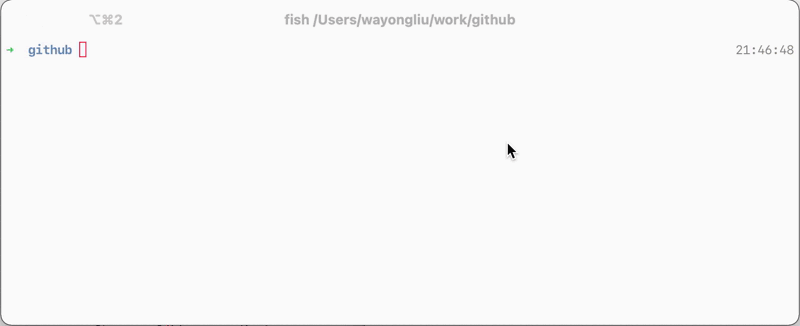

# angular-commit-complete

fish complete for they `<type>` part of angular commit message, that is, in the format of 

> `<type>(<scope>): <short summary>`

👉 Read more for the [angular commit message format](https://github.com/angular/angular/blob/master/CONTRIBUTING.md#type).

## Motivation

While the convention of angular commit message format is good but I find it's hard to remember or determine which `<type>` in every single commit.

If there's a hint or complete that list all the types available, it's much better. While this is possible in fish shell with the `complete` command.

Although it's not perfect at present, it's just works, which, I mean, it does list all the types when you do a commit.

When I say it's not perfect, I mean the fish `complete` cannot completes arguments with quotation marks, so, instead of `git commit -m "build`, what we get after choosing a candidate is `git commit -m build`. 

## Installing

```sh
curl https://raw.githubusercontent.com/wayou/angular-commit-complete/master/git.fish > ~/.config/fish/completions/git.fish
```

## usage

Restart the terminal session or `source ~/.config/fish/completions/git.fish` to make the complete take palces.

Commit as usually and using <kbd>TAB</kbd> to trigger the complete.

```
$ git commit -m <tab>
# or
$ git commit --message <tab>
test                                                     (Adding missing tests or correcting existing tests)
refactor                                         (A code change that neither fixes a bug nor adds a feature)
perf                                                               (A code change that improves performance)
fix                                                                                              (A bug fix)
feat                                                                                         (A new feature)
docs                                                                            (Documentation only changes)
ci     (Changes to our CI configuration files and scripts (example scopes: Circle, BrowserStack, SauceLabs))
build  (Changes that affect the build system or \r\ntexternal dependencies (example scopes: gulp, broccoli…)
```

## Preview




